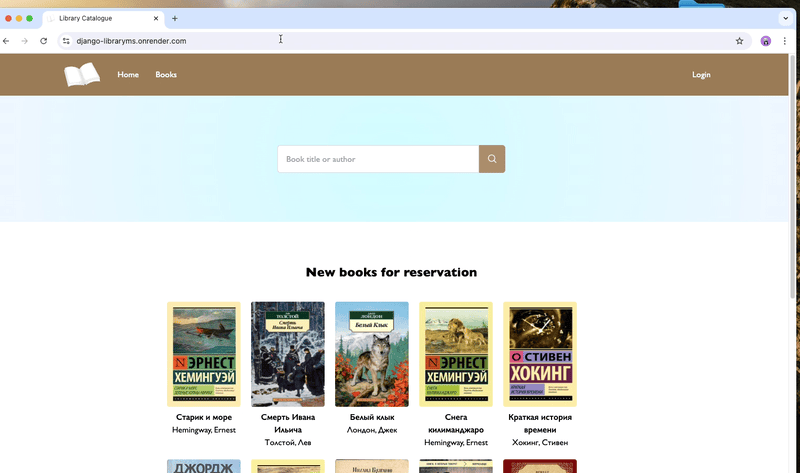
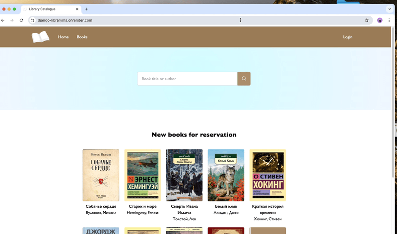

## Library management system on Django and Vue.js

### MVP Goal & Requirements
Check out the [MVP Goal & Requirements](../../wiki/MVP-Goal-&-Requirements)

## Demo
#### Member orders a book

#### Librarian processes the order


## Project setup

#### Tool versions
Check [tool-versions](./.tool-versions)

#### Clone locally with frontend submodule(separate repo)
```shell
git clone --recurse-submodules git@github.com:peacefulseeker/django-libraryms.git ./local-project-dir

cd ./local-project-dir
cp src/core/.env.ci src/core/.env
```
Set `DEBUG=true` and other env variables such as DATABASE_URL in `src/core/.env`
to match your local environment setup.


#### Build backend
Installs poetry, collects static assets, runs migrations, creates superuser(admin env vars required)
```shell
# change as you prefer
export ADMIN_USERNAME=admin
       ADMIN_EMAIL=admin@admin.com
       ADMIN_PASSWORD=admin
./scripts/build-backend.sh

# build frontend, in case you want to see UI when visiting homepage
./scripts/build-frontend.sh
```

#### Run server in development mode
```shell
make server
# same as
make s
# aliased to
poetry run python src/manage.py runserver 7070
```

#### Simulate production server
```shell
# builds both backend and frontend
./scripts/build.sh

# runs gunicorn server, serving frontend static assets(check aliases in Makefile)
make prod
```

### Further plans
Check out the [TODO](../../wiki/TODO)

